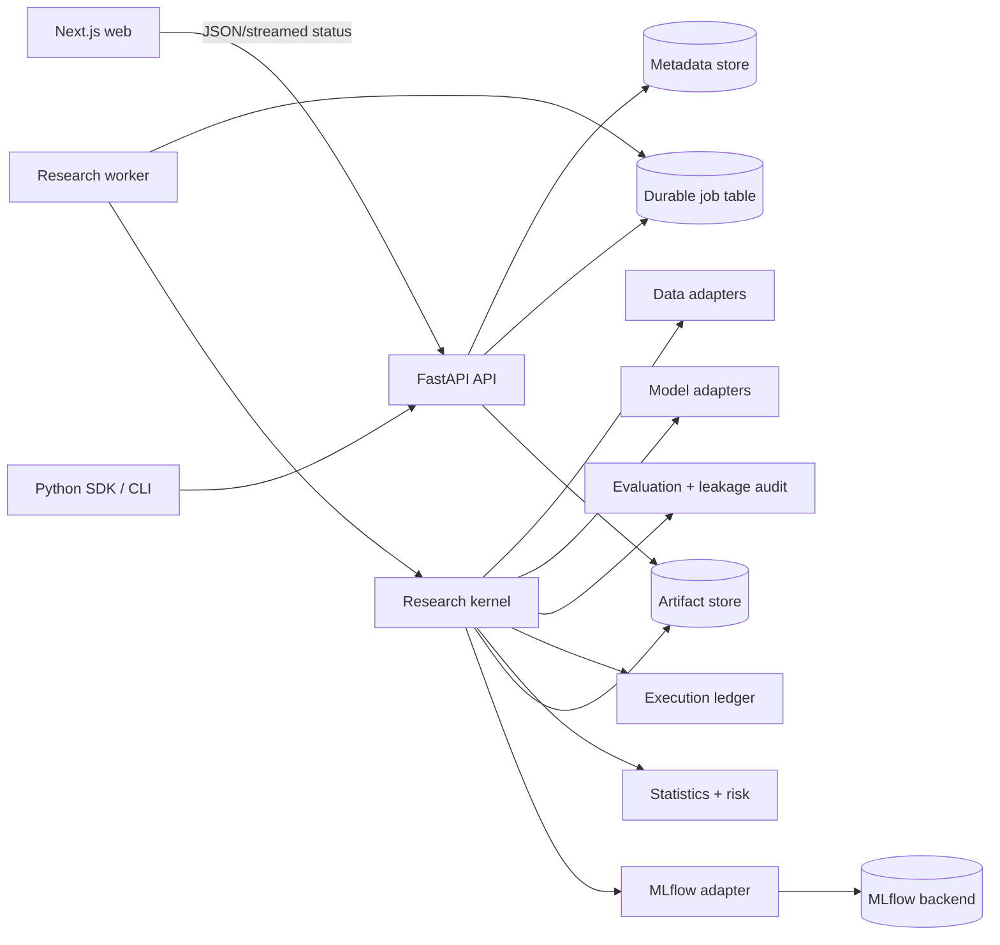
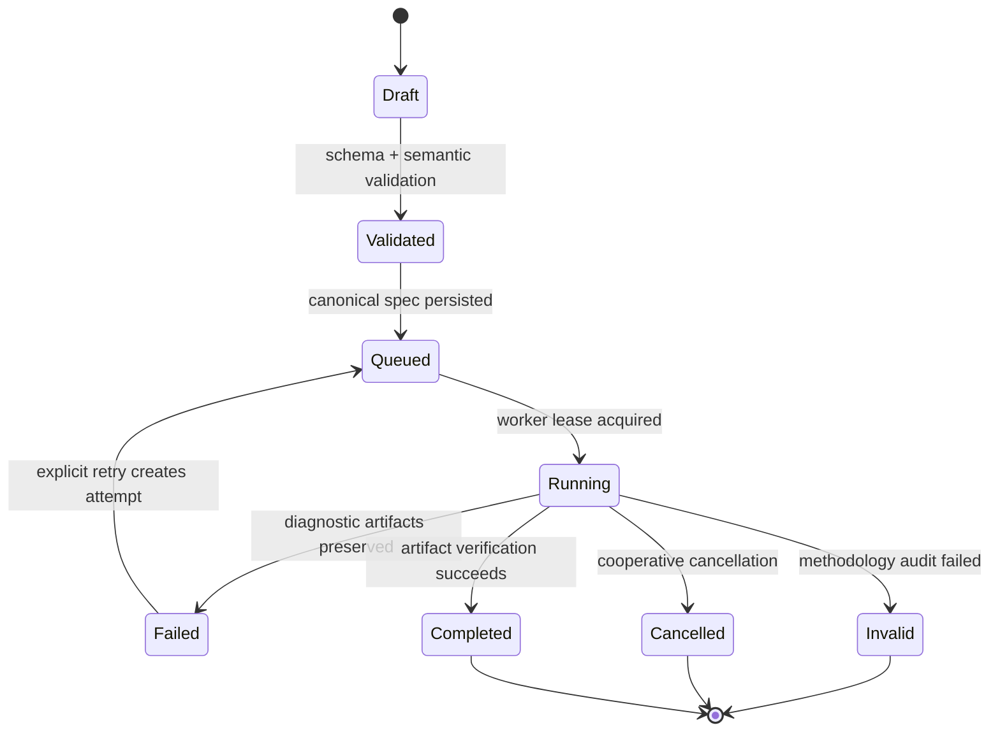
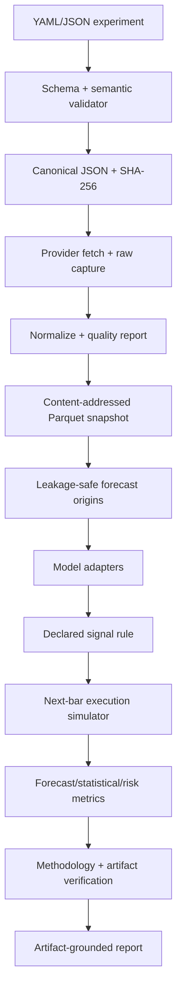

# OpenAlpha Architecture

## Architectural position

OpenAlpha uses a modular monorepo and a ports-and-adapters design. Financial and statistical semantics live in typed Python packages with minimal framework coupling. FastAPI, MLflow, data vendors, storage systems, and the web application adapt to those contracts.

Three approaches were considered:

1. **Modular monorepo with separate API and worker processes — selected.** It supports a complete vertical slice, preserves process isolation for expensive work, and can evolve without premature distributed-systems overhead.
2. **Microservices from the start — rejected.** It would add deployment, versioning, tracing, and failure-mode complexity before the research contracts are proven.
3. **Python-only dashboard or notebook platform — rejected.** It would shorten the demo path but weaken product architecture, durable jobs, frontend quality, and enforceable audit boundaries.

## Repository shape

```text
open-alpha/
├── apps/
│   ├── api/                     # FastAPI transport and composition root
│   ├── worker/                  # durable research-job execution
│   └── web/                     # Next.js research workspace
├── packages/
│   ├── experiment-spec/         # versioned schema, migrations, canonical hash
│   ├── research-core/           # orchestration contracts and run lifecycle
│   ├── data-connectors/         # provider ports, validation, snapshots
│   ├── model-adapters/          # Kronos and baseline model contracts
│   ├── evaluation/              # rolling origins and leakage audit
│   ├── backtesting/             # canonical orders, fills, cash, holdings
│   ├── portfolio/               # allocation policies and constraints
│   ├── risk/                    # risk measures and stress tests
│   ├── statistics/              # inference, bootstrap, model comparison
│   ├── reporting/               # artifact-only HTML/PDF reports
│   ├── tracking/                # MLflow adapter and lineage DTOs
│   └── python-sdk/              # public client and CLI
├── research/
│   ├── experiments/             # reviewed specifications, not mutable results
│   ├── notebooks/               # exploration only; imports production packages
│   ├── reports/                 # generated local outputs, normally ignored
│   └── benchmarks/              # performance and parity harnesses
├── infrastructure/              # Compose, migrations, deployment definitions
├── tests/                       # cross-package integration/e2e/reproducibility
├── docs/
├── examples/
└── scripts/
```

Directory names may contain hyphens; importable Python modules use valid underscored names such as `openalpha_experiment_spec`.

## Runtime topology



The API validates and enqueues. It does not perform model inference or backtests on request threads. The worker owns state transitions and publishes immutable artifacts before a run can become `completed`.

## Research-run lifecycle



Run state is append-only at the event level. A retry is a new attempt linked to the same immutable specification, not a rewrite of a failed attempt.

## Data flow and lineage



Every box emits a versioned artifact with:

- schema version;
- producer component and version;
- run ID and experiment hash;
- input artifact hashes;
- creation timestamp;
- content hash;
- code commit and dirty-tree state;
- dependency-lock hash;
- relevant parameters and seed.

## Core contracts

### Experiment specification

- Pydantic models define syntax and cross-field semantics.
- YAML and JSON are parsed into one normalized model.
- Canonical JSON is UTF-8, key-sorted, finite-number-only, and hashed with SHA-256.
- The canonical bytes are stored before the run is queued.
- Unknown fields fail by default.
- Migrations are explicit pure functions from one version to the next.

### Data snapshot

- Provider adapters return a provider-neutral OHLCV table plus retrieval metadata.
- Timestamps are timezone-aware and aligned to a named trading calendar.
- Raw provider responses and normalized Parquet receive separate hashes.
- Corporate-action policy and adjustment status are mandatory.
- Quality failures can invalidate a run; warnings remain visible in every downstream view.

### Model adapter

Each adapter declares capabilities, required columns, frequency/horizon support, fit policy, probabilistic outputs, hardware requirements, serialization, model-card metadata, and checkpoint identity.

The adapter receives only a causal training/context view and explicit future calendar timestamps. It returns a typed forecast distribution/path plus diagnostics. It cannot read the full experiment dataset.

### Evaluation and leakage audit

The splitter creates forecast-origin objects containing train, optional validation, purge, embargo, test, signal, and execution timestamps. Features receive a cutoff-enforcing frame. Any future timestamp, global preprocessing, overlapping unpurged labels, or same-bar execution produces a failed methodology check.

### Execution and accounting

OpenAlpha owns the authoritative order/fill/accounting ledger. Its event records include decision time, intended and simulated execution time, price, quantity, reason, fees, slippage, status, and rejection reason. Cash and holdings are derived from fills and reconciled independently.

VectorBT may consume deterministic results for analytics or parity tests; it is never the sole source of authoritative fill history.

### Reporting

Reports load only verified artifacts. Narrative templates distinguish computed values, interpretation, assumptions, and limitations. A language model is never an allowed source of numerical report fields.

## Storage profiles

| Concern | Laptop `lite` | Full profile |
|---|---|---|
| Platform metadata/jobs | SQLite | PostgreSQL |
| Analytical queries | DuckDB over Parquet | DuckDB over Parquet/object storage |
| Market snapshots | Local content-addressed files | S3-compatible object storage |
| MLflow backend | Explicit SQLite URI | PostgreSQL |
| MLflow artifacts | Explicit local directory | Proxied object storage |

Repositories expose ports so storage promotion changes configuration, not financial logic. SQLite is not used for high-concurrency production claims.

## Kronos integration

- Vendor or depend on a pinned official commit; never track `master`.
- Pin model and tokenizer Hugging Face revisions and verify SHA-256 before loading.
- Call `eval()` on both model and tokenizer.
- Seed PyTorch and record sampling parameters, sample count, device, dtype, and deterministic settings.
- Validate OHLC constraints, finiteness, and nonnegative activity fields after inference.
- Use exactly the declared causal context and keep base/small contexts at or below 512 bars.
- Begin evidentiary evaluation after the June 2024 pretraining cutoff.
- `lite` may use official Kronos-mini for a real CPU smoke/demo run; research comparisons label the checkpoint and do not equate mini with published base results.

## MLflow boundary

The tracking adapter logs run identifiers, parameters, metrics, dataset references, artifacts, and immutable model versions. OpenAlpha still stores its own canonical manifest because MLflow captures only submitted data and does not preserve uncommitted code, underlying datasets, or bit-for-bit environments.

Aliases such as `candidate` and `champion` are mutable governance conveniences. Audit and reproduction paths resolve and store the exact model version and checkpoint hashes.

## Error handling

- Validation errors identify the field, rejected value category, and corrective action without echoing secrets.
- Data-quality and methodology errors produce structured findings with severity and evidence.
- Resource failures report estimated requirement, observed device/memory, checkpoint, and remediation.
- Worker failures retain logs and diagnostic artifacts but cannot publish a completed manifest.
- Artifact hash mismatch marks a run invalid and prevents report publication.
- API errors use stable machine-readable codes and correlation IDs.

## Testing architecture

- Unit and property tests protect canonicalization, split causality, accounting, and statistics.
- Contract tests run every data/model/storage adapter against shared behavioral suites.
- Golden tests cover fills, equity, drawdowns, and report data bindings.
- Integration tests exercise API → queue → worker → artifacts with real lightweight baselines.
- A separately marked slow test performs real official Kronos inference.
- Frontend tests verify provenance, warnings, empty/failure states, keyboard paths, and accessible labels.
- End-to-end and reproducibility tests rerun a small real-data experiment and verify declared artifact hashes.

## Security boundaries

The web/API boundary is untrusted. Provider payloads, specifications, model files, artifact paths, and future copilot content are all untrusted inputs. Checkpoint loading uses safetensors and pinned revisions without arbitrary remote code. See `docs/THREAT_MODEL.md`.

