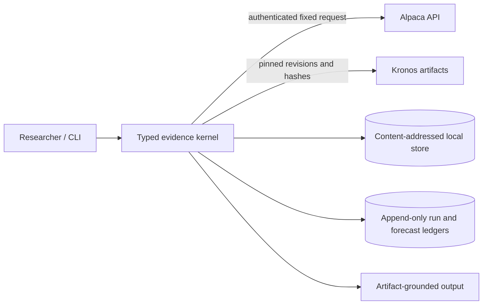

# OpenAlpha Threat Model

## Scope

The protected asset is credible evidence: protocol identity, provider and checkpoint provenance, forecast immutability, outcome append-only behavior, artifact integrity, evidence-class separation, and the distinction between completed, failed, and unresolved work. An integrity failure can create a false financial claim even when no confidential data leaks.

## Initial trust boundaries

Protocol files, environment configuration, provider payloads, checkpoint files, timestamps, artifact references, and imported report inputs are untrusted until validated.

## Research-integrity threats

| Threat | Required control |
|---|---|
| Future information enters a forecast | Cutoff-enforcing frames, exchange-session calendars, causal features, rolling-origin tests |
| An attractive forecast or protocol is edited | Canonical protocol hash, content-addressed forecast, append-only outcome record |
| Retrospective output is presented as live | Mandatory evidence class on forecasts, outcomes, metrics, aggregates, and claims |
| Failed or unresolved forecasts disappear | Durable status records and complete navigation/search surfaces |
| Results are cherry-picked | Preregistered assets, origins, horizons, models, exclusions, and multiplicity family |
| Costs or execution are relaxed | Immutable strategy/cost policy and next-permitted-bar execution |
| A named dataset or checkpoint changes | Provider response, normalized snapshot, revision, and file hashes |
| A report fabricates a value | Render numerical claims only from verified artifact fields |

## Provider and secret threats

- Read `APCA_API_KEY_ID` and `APCA_API_SECRET_KEY` only from the environment.
- Never place credentials in protocols, logs, exceptions, manifests, fixtures, reports, or command history.
- Use a fixed HTTPS host and bounded request fields; do not accept arbitrary URLs.
- Pin feed, timeframe, start, end, adjustment, and as-of behavior; reject silent fallback.
- Bound timeouts, retries, page counts, response size, and pagination tokens; detect page cycles.
- Validate content and date bounds before persistence.
- Keep raw responses local and out of Git; publish no raw provider data without documented permission.

## File and ledger threats

- Preserve the existing confined, content-addressed artifact store and reject traversal, absolute paths, reserved names, symlink escapes, hash mismatches, and conflicting publication.
- Persist forecasts before any outcome loader is invoked.
- Make a forecast payload immutable after creation; corrections and outcomes reference the original hash.
- Reject early, duplicate, or forecast-mismatched outcome resolution.
- Hash-chain forecast and outcome records and verify the full chain, not only the latest record.
- A completed-run manifest is valid only after all referenced artifacts and methodology status verify.

## Model supply-chain and resource threats

- Pin the reviewed Kronos source commit, checkpoint/tokenizer revisions, expected hashes, and license metadata.
- Do not enable arbitrary remote code or load untrusted pickle/joblib files.
- Record evaluation mode, seed controls, runtime, hardware, and failure diagnostics.
- Enforce context, horizon, asset, date-range, download-size, memory, and execution-time bounds.
- A real Kronos failure remains a failed forecast; a fake adapter may not substitute outside tests.

## Future presentation boundary

The first release is CLI-only. A later read-only dashboard must consume the same verified artifacts, escape report data, use opaque artifact identifiers, preserve evidence labels and warnings, and expose adjacent, failed, and unresolved forecasts. Accounts, brokerage execution, arbitrary strategy code, and an AI copilot are outside the product scope.

## Verification

Tests cover canonical hashing, path confinement, secret redaction, fixed-host requests, pagination bounds, malformed payloads, causal cutoffs, early and duplicate outcomes, hash-chain tampering, evidence-class separation, and manifest verification. Network and real-Kronos checks are separately marked and cannot be replaced with synthetic evidence.

## Residual risk

Hashing proves identity, not truth. A provider can be wrong, adjusted history can be revised, a checkpoint can contain unknown contamination, and statistically defensible results can fail to generalize. Those limitations remain visible in the audit page and report.
