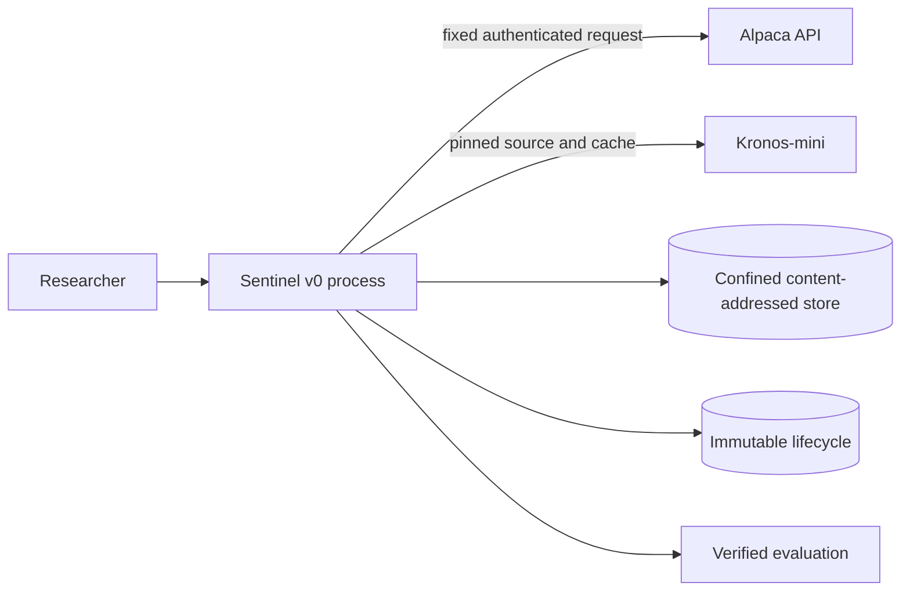

# OpenAlpha Sentinel Threat Model

## Protected evidence

Sentinel's primary risk is a false forecast-time reliability claim. Protected assets include experiment identity, chronological split, causal contexts, model/provider identity, raw forecast paths, pre-outcome diagnostics, frozen risk/action configuration, immutable outcomes, and complete failure accounting.

## Initial trust boundaries

Provider payloads, model files, timestamps, experiment YAML, cache paths, and report inputs are untrusted until validated.

## Research-integrity threats

| Threat | Control |
|---|---|
| Future data enters diagnostics | Cutoff-specific context types; resolved-prior-only analogue/model-error inputs |
| Holdout tunes Sentinel | Separate immutable development freeze artifact; holdout resolver accepts its hash |
| Failed requests disappear | Every scheduled origin/configuration has success or failure status |
| Sampling disagreement is hidden | One generated path per seeded request; all nine responses retained |
| Risk reasons become narratives | Fixed taxonomy, thresholds, contribution math, and templates |
| Favorable coverage is selected | Always report 100/90/80/70/50% |
| One asset drives the result | Per-asset criteria plus pooled result |
| Experiment configuration changes | Content-addressed `experiment.yaml` and manifest identity |
| Outcome rewrites decision | Append-only resolution and postmortem records |

## Provider and secret controls

- Alpaca credentials are environment-only and redacted.
- The host and historical-bars endpoint are fixed.
- Feed, timeframe, dates, adjustment, as-of, sort, and pagination are explicit.
- Raw responses are bounded, validated, hashed, and discarded.
- No Yahoo or other provider fallback exists.

## Model supply chain

- Pin official Kronos source, model, and tokenizer revisions.
- Record downloaded file hashes before inference.
- Store caches outside Git and enforce a size bound.
- Do not use arbitrary remote code or untrusted pickle/joblib.
- Record device, library versions, seeds, runtime, and failures.
- Test fakes carry a synthetic marker and cannot produce admissible evidence.

## Artifact controls

Existing path confinement, content hashes, atomic publication, size/media/schema checks, acyclic lineage, journals, and manifest verification remain authoritative. Sentinel payloads use those primitives instead of introducing a database.

## Resource and cost controls

Bound contexts to 512, horizon to five, requests to nine per cutoff, data to two ETFs, weekly origins, page counts, retries, response sizes, cache size, latency, and hosted-equivalent cost. Exceeding the locked feasibility criterion is evidence against the approach.

## Deferred surfaces

There is no frontend, public API/SDK, account system, live trading, arbitrary model upload, user-authored code, or event-data integration in v0. Adding any of these requires a new threat review after the holdout decision.

## Residual risk

Hashes prove identity, not truth. Adjusted history may be revised, seeds may not be bit-exact across hardware, Kronos pretraining provenance is incomplete, analogue similarity is not causal equivalence, and an apparently successful two-ETF holdout may not generalize.
