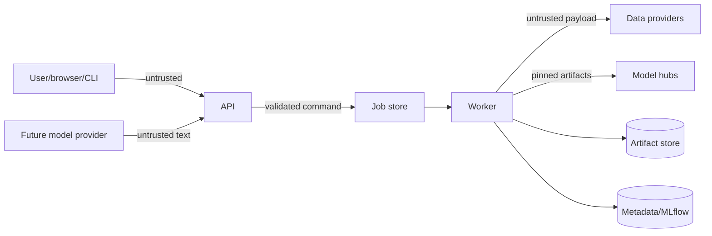

# OpenAlpha Threat Model

## Scope and assets

Protected assets include:

- experiment integrity and immutability;
- data, checkpoint, and artifact provenance;
- API/worker availability;
- local and hosted secrets;
- user-supplied specifications and reports;
- append-only forecast and execution records;
- the distinction between valid, warned, failed, and incomplete research.

The primary security objective is not merely confidentiality. An undetected integrity failure can create false financial evidence.

## Trust boundaries

Specifications, uploaded files, provider responses, model metadata, checkpoints, artifact paths, and copilot output are untrusted.

## Threats and controls

### Research-integrity threats

| Threat | Control |
|---|---|
| Future information enters a forecast | Cutoff-enforcing frames, timestamp-aware joins, split property tests, leakage audit |
| A run is edited after attractive results appear | Canonical spec hash, append-only events, content-addressed artifacts |
| Failed/incomplete output is shown as evidence | Terminal-state manifest verification and UI validity gates |
| Results are cherry-picked across many trials | Registered hypothesis family, run search visibility, multiplicity correction |
| Costs or benchmark assumptions are weakened | Immutable execution assumptions and gross/net side-by-side results |
| A checkpoint or dataset changes at the same name | Revision pins plus SHA-256 verification |
| Ledger history is rewritten | Append-only records; corrections reference originals; optional hash chaining |

### Input and API threats

- Reject unknown specification fields, non-finite numbers, oversized arrays/strings, unsafe URLs, and excessive nesting.
- Parse YAML with a safe loader; disable object construction and aliases beyond a small configured expansion limit.
- Enforce request-body, upload, date-range, asset-count, model-count, and forecast-horizon limits.
- Use structured error codes without stack traces or secret values.
- Add rate limits and authentication boundaries before multi-user deployment.

### File and artifact threats

- Resolve artifact paths under a configured root and reject traversal, absolute paths, reserved device names, and symlink escapes.
- Write to a temporary sibling, fsync where supported, verify the hash, then atomically publish.
- Treat HTML/report inputs as data and escape them.
- Never load untrusted pickle/joblib artifacts. Prefer JSON, Parquet, safetensors, and explicit model formats.
- Verify artifact MIME/type, schema version, size, and content hash before use.

### Model supply-chain threats

- Pin Hugging Face repository revisions and expected file hashes.
- Load Kronos safetensors/config through reviewed code without `trust_remote_code`.
- Pin the official integration commit; do not execute a moving Git branch.
- Record licenses and prohibit models with unknown or incompatible terms from approved status.
- Scan Python, JavaScript, container, and workflow dependencies; generate an SBOM for releases.

### Provider and network threats

- Provider adapters use allow-listed schemes/hosts and fixed endpoints to prevent SSRF.
- Set connect/read/total timeouts, bounded retries with jitter, response-size limits, and rate-limit handling.
- Validate content before persistence; a successful HTTP response is not valid market data.
- Keep API keys in environment/secret stores and redact them from logs, MLflow tags, manifests, and reports.

### Worker and availability threats

- Expensive jobs run in separate processes with leases, heartbeats, timeouts, cancellation checkpoints, and memory/resource limits.
- A worker crash leaves a recoverable diagnostic state; lease expiry never marks a run completed.
- Concurrency, downloaded model size, date range, and artifact quotas are configurable.
- Job retries create new attempt events and avoid duplicate publication through idempotency keys.

### Web threats

- Apply CSP, secure cookies, CSRF protection where cookie authentication exists, strict CORS, and output encoding.
- Do not render provider/copilot Markdown as unrestricted HTML.
- Provenance links use opaque IDs, not raw filesystem paths.
- Red/green states have text and accessible semantics; warnings cannot be hidden by color alone.

### Copilot threats

The future copilot is a configuration and interpretation layer:

- generated specifications remain drafts until validation and explicit user approval;
- retrieved documents and artifact text are untrusted and cannot override system policy;
- tools expose least-privilege typed operations, not arbitrary shell/database access;
- numerical statements must cite artifact fields;
- prompts, provider, model version, output, validation findings, and approval are auditable;
- the copilot cannot mutate completed artifacts or place real-money orders.

## STRIDE summary

- **Spoofing:** authenticate users/services in hosted mode; sign worker identity and scope service credentials.
- **Tampering:** hashes, atomic publication, append-only events, database constraints, and optional signatures/hash chains.
- **Repudiation:** correlation IDs, actor/action audit logs, immutable run events, and explicit approvals.
- **Information disclosure:** secret redaction, minimal error responses, artifact authorization, and private-by-default provider payloads.
- **Denial of service:** quotas, rate limits, job isolation, bounded parsing/fetches, cancellation, and timeouts.
- **Elevation of privilege:** no arbitrary code/model loading, least-privilege service roles, strict admin promotion boundary.

## Security verification

- Secret scanning and dependency audit in CI.
- Static analysis for Python, TypeScript, containers, and workflows.
- Tests for traversal, YAML bombs, oversized specifications, malformed Parquet, checkpoint mismatch, SSRF host rejection, and log redaction.
- Authorization matrix tests when accounts exist.
- Threat-model review for every new external provider, model format, execution provider, and copilot tool.

## Residual risk

Hashing establishes identity, not truth. A provider can supply incorrect data; a model can encode contaminated training information; a statistically valid study can fail to generalize. Reports must retain these limitations.

